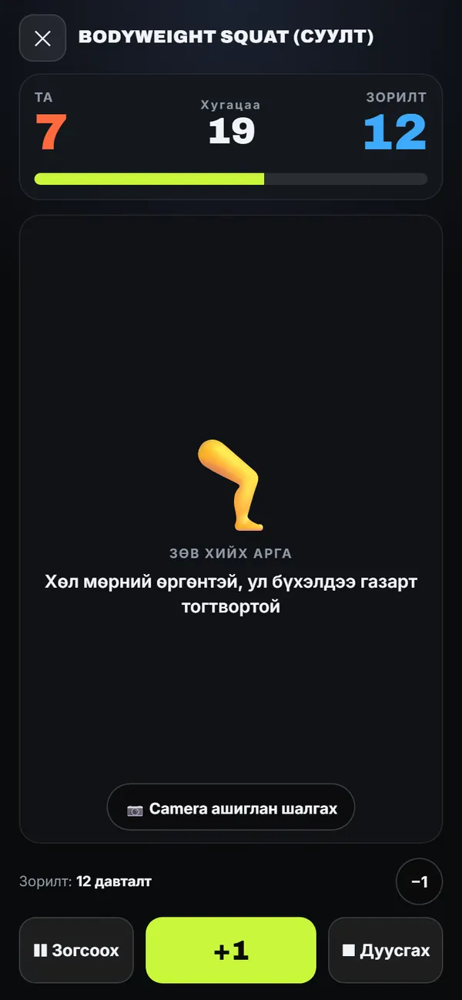
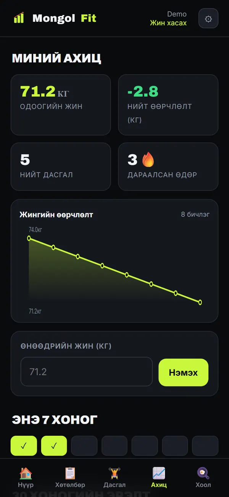
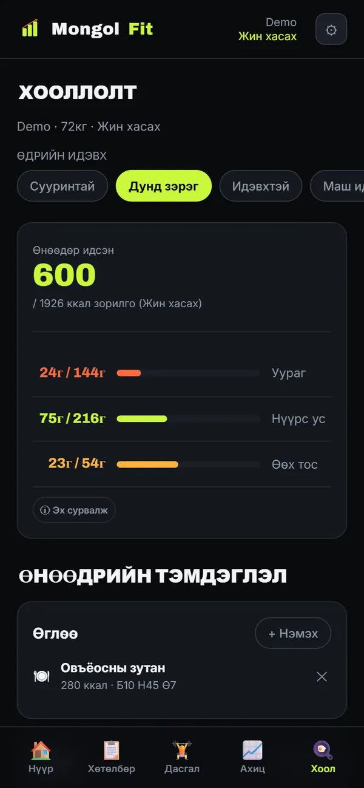
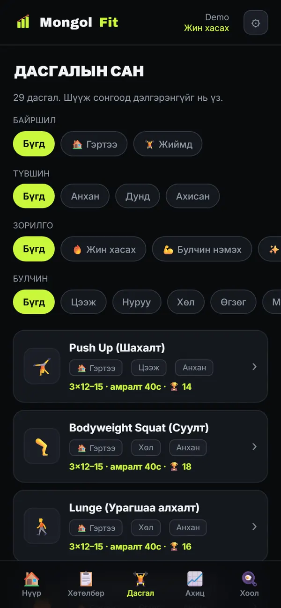

# MongolFit 🇲🇳

### Гэр & Жийм дасгалын платформ

[](https://fitzone-five-jet.vercel.app/)
[](https://github.com/bayraaaBMG/Fitzone)

**MongolFit** is a Mongolian fitness web platform designed for both home and gym workouts.

It helps users discover exercises, track workouts, monitor progress, record nutrition-related information, and use camera-assisted exercise tracking on supported movements.

**Live:**
https://fitzone-five-jet.vercel.app/

The interface is Mongolian by default, with a full English translation built in.

---

## 📱 Screenshots

| Home | Workout | Progress |
|---|---|---|
|  |  |  |

| Nutrition | Exercise library |
|---|---|
|  |  |

*Captured from a demo account. No real user data appears anywhere in this repository.*

---

## ✨ Features

### 🏋️ Workout Tracking
- Exercise library — **29 exercises**, home and gym, three difficulty levels
- Weekly plan generated from goal, level, available days, session length and equipment
- Workout sessions
- Repetition tracking
- Timer-based exercises
- Pause / resume / finish
- Rest timer between sets
- Personal records
- Workout history
- Streak tracking
- 30-day challenge

### 📷 Camera-Assisted Exercise Tracking
MongolFit uses the device camera and MediaPipe Pose for supported exercises.

The system:
- detects body landmarks
- checks required body visibility
- tracks movement phases
- validates movement range
- uses exercise-specific rules
- reduces false duplicate counts with state machines and cooldowns

Automatic counting covers **15 of the 29 exercises**. The remaining **14** use
camera form guidance with manual repetition tracking.

The camera is never started on its own: it turns on only when you press the
camera button inside a workout, processing happens on your device, and no video
is recorded, stored or uploaded.

Camera-based feedback is an estimate and may be affected by:
- camera angle
- lighting
- body visibility
- movement speed
- temporary landmark loss

### 📈 Progress & Nutrition
- Weight log with chart
- Completed-workout history and per-exercise statistics
- Food log with calories and macros, plus **45 recipes**
- Pantry list and meal suggestions
- Water tracking

### 🌐 Platform
- Installable PWA (works offline once cached, via a service worker)
- Mongolian / English throughout
- Dark and light themes
- Email and Google sign-in (Firebase Authentication)
- Cloud sync per account (Cloud Firestore), with a local copy for offline use
- Public landing page, privacy policy and terms

---

## 🤖 AI V2

MongolFit includes an **AI V2 foundation** for future custom exercise intelligence.

Architecture:

```text
Camera
   ↓
MediaPipe Pose
   ↓
33 Body Landmarks
   ↓
Feature Extraction
   ↓
Temporal Sequence
   ↓
Custom ML Model
   ↓
Form / Phase / Mistake Analysis
   ↓
Coaching
```

**Current status: foundation only.**

- AI V2 is **off by default** (`AI_V2_DEFAULT_ENABLED = false`) and its code is
  never loaded during startup.
- **No trained model ships with this repository** and none is served in
  production, so the app always runs on the rule-based path above.
- It is designed to sit *beside* MediaPipe Pose, never to replace it, and never
  to count repetitions on its own.
- Pilot exercises planned for the first model: squat, push-up, lunge.
- The Python training and export pipeline lives in [`ml/`](ml/) and runs on
  synthetic fixtures. Real accuracy requires a real labelled dataset — see
  [`ml/README.md`](ml/README.md) and `ml/data/README.md`.

---

## 🧱 Tech stack

| Layer | Choice |
|---|---|
| Frontend | Vanilla JavaScript, HTML, CSS — no framework, no build step |
| Pose | MediaPipe Tasks Vision 1.0.1 (`pose_landmarker_lite`), loaded on demand |
| Auth | Firebase Authentication 10.13 (email + Google) |
| Database | Cloud Firestore, one document per account |
| Hosting | Vercel |
| Offline | Service worker cache + `localStorage` copy of the account state |
| ML pipeline | Python, PyTorch, ONNX (training only — never shipped to the browser) |

---

## 📂 Project structure

```text
index.html          public landing page (no Firebase, camera or ML code)
privacy.html        privacy policy
terms.html          terms of service
404.html            not-found page
Fitzone.html        the app shell
css/
  style.css         app styles
  public.css        public pages
js/
  app.js            startup, auth state, routing
  auth.js           Firebase auth + cloud load/sanitize
  state.js          state and save()
  core.js           render dispatcher, shared UI
  data.js           exercise database
  coach-data.js     per-exercise coaching and camera metadata
  foods.js          foods and recipes
  planner.js        weekly plan generation
  pose.js           MediaPipe loader and camera loop
  pose-rules.js     per-exercise angle rules and rep state machine
  records.js        personal records, streaks, statistics
  i18n.js           app translations (MN/EN)
  public.js         landing-page behaviour
  views/            one file per screen
  ai/               AI V2 (lazy-loaded, off by default)
ml/                 Python training + export pipeline
firestore.rules     security rules
vercel.json         routes, rewrites and cache headers
sw.js               service worker
```

---

## 🚦 Routes

| Path | Serves |
|---|---|
| `/` | Public landing page |
| `/login`, `/register` | Sign in / sign up |
| `/app` | The application |
| `/privacy`, `/terms` | Policy pages |

Installed PWAs keep `start_url` at `./Fitzone.html`, so existing installs are
unaffected by the routing.

---

## 🛠️ Local development

There is no build step. Any static server works for the app shell:

```bash
python -m http.server 8000
# then open http://localhost:8000/Fitzone.html
```

The clean routes (`/app`, `/login`, `/privacy`, …) come from the rewrites in
`vercel.json`, so use the Vercel CLI if you want them locally:

```bash
npx vercel dev
```

Firebase configuration lives in `js/firebase-config.js`. Web API keys are
public identifiers, not secrets — access is controlled by the Firestore rules
below.

For the ML pipeline:

```bash
pip install -r ml/requirements.txt
pytest ml/tests
```

---

## 🔐 Security & privacy

- Every account's data lives in a single Firestore document, readable and
  writable **only by its owner**.
- Beyond owner-only access, `firestore.rules` validates the shape of every
  write: an allowlist of fields, per-field types, size limits, and an
  image-only pattern for profile photos.
- The app sanitizes everything it reads back, so a hostile document cannot
  reach the renderer.
- The camera runs on the device. No video or image is uploaded or stored.
- Meal photos are shown on screen only and are never saved.
- Signing out deletes the local copy of the account data.

Full detail, in plain language: [privacy policy](https://fitzone-five-jet.vercel.app/privacy).

---

## ⚠️ Disclaimer

MongolFit is an informational fitness tool. It is **not** medical advice,
diagnosis or treatment. Exercise carries physical risk — consult a doctor
before starting, and stop if you feel pain, dizziness or shortness of breath.
Repetition counts, calories and camera form feedback are estimates.

See the [terms of service](https://fitzone-five-jet.vercel.app/terms).

---

## 📜 License

No license has been chosen yet, so default copyright applies: all rights
reserved by the author.
